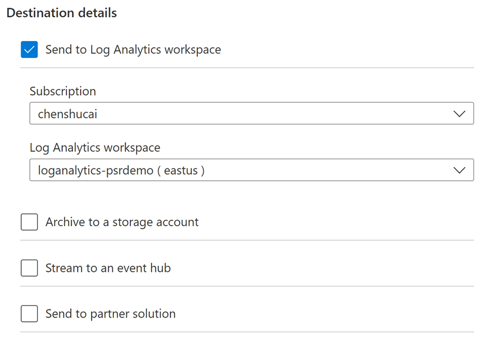
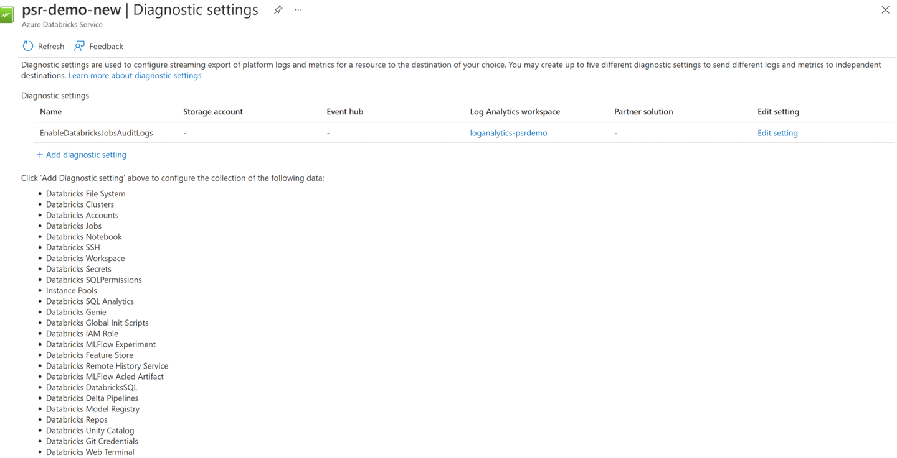
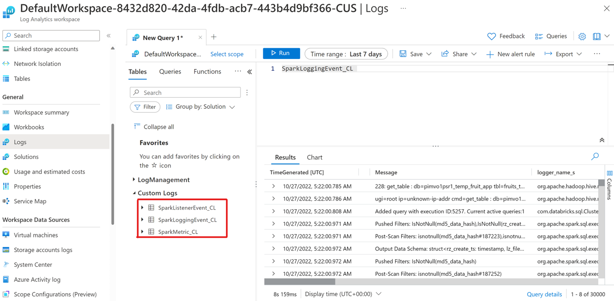
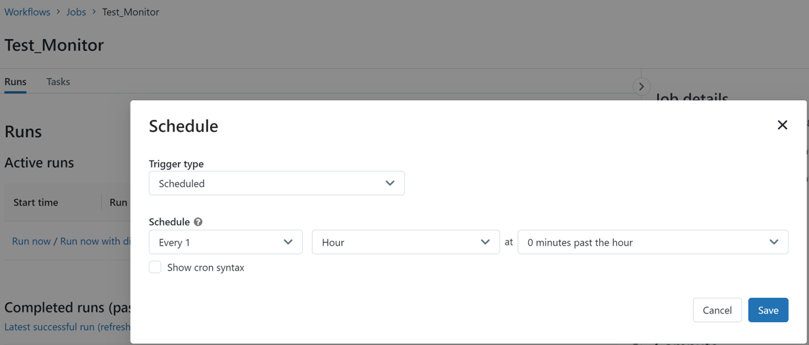
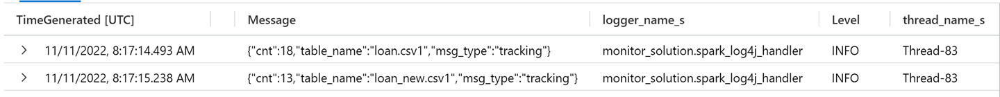

# Monitoring Azure Databricks jobs

## Overview 
Azure Databricks is an Apache Spark–based analytics service which can boost productivity by integrating a set of tools for developing, deploying, sharing, and maintaining big data analytics and artificial intelligence solutions. 

It is of great significance to have a monitoring part for any production-level solution, and Azure Databricks has some native functionalities with Azure Monitor that allows you to monitor workspace-level events, as well as some solutions to send more detailed custom application metrics, and application log messages for the spark jobs running on Databricks.

## Types of Metrics
After collecting and analyzing log and performance data, you can get a list of metrics. There are multiple types of metrics that you can monitor.
For jobs monitoring, you can pay attention to the following aspects.

System resource usage and health check
1.	Average CPU usage
2.	Average used memory (MB) 
3.	Resource health check: cluster readiness and workspace availability

Task metrics
1.	One task metric is duration of a task execution, another metric is the scheduler delay, which measures how long it takes to schedule a task, as well as the result for each execution. 
2.	Streaming throughput
Streaming throughput is to monitor structured streaming queries on Azure Databricks. There are several important metrics related to streaming progress: number of input rows, Input rows per second and processed rows per second, which help you to understand how many records are processed in a trigger, and the rate of data arriving and data processing.

For data observability, you can focus on the following categories.

1.	Data flow tracking, which emphasizes how much data has been processed in each stage.
2.	Data validation, which helps to ensure the incoming data satisfies the pre-defined requirements.
3.	Data health check, which checks how robust the records are after collecting, analyzing, and reviewing data.

## Data Collection
You can collect metrics from the following sources. After application data and logs are sent to the Azure Log Analytics workspace, they can be evaluated by using a rich query language.
### Azure Diagnostic Logs
Azure Databricks users perform a series of activities, and you can monitor detailed Azure Databricks usage patterns by turning on diagnostic logging. 

Diagnostic settings in Azure are used to collect resource logs. Platform metrics and the Activity logs can be collected automatically after creating a diagnostic setting to collect resource logs or forward them outside of Azure Monitor. 

While [configuring diagnostic log delivery](https://learn.microsoft.com/en-us/azure/databricks/administration-guide/account-settings/azure-diagnostic-logs#configure-diagnostic-log-delivery), you must make sure that Azure Databricks uses the premium plan.

You can turn on diagnostic setting for Azure Databricks and deliver resource logs to the following Azure sources:


And you can get a collection of the following data:


### Spark Monitoring Logs
Another way to [send Azure Databricks application logs](https://learn.microsoft.com/en-us/azure/architecture/databricks-monitoring/application-logs) is to use the [Azure Databricks Monitoring Library](https://github.com/mspnp/spark-monitoring), which is now available on GitHub. You can send monitoring data from Azure Databricks to a Log Analytics workspace to get the custom logs.

Since Spark driver logs are composed of Standard output, Standard error and Log4j output logs. And almost all Spark jobs processing logs can be found in Log4j output logs, which could be sent to Azure Log Analytics workspace after configuring Azure Databricks workspace and cluster.

To view the sample jobs run in Databricks, go to Azure Log Analytics workspace, and check related output logs by querying custom tables from Custom Logs.


```
# Query all Log4j output logs
SparkLoggingEvent_CL  
```

This custom log will contain data forwarded from Log4j. The volume of logging can be controlled by altering the level of logging forward or with filtering. For example, you can define the customized framework logs using Log4j, which would be sent to this table and could be queried by filtering logger_name_s.

For the other two tables ( SparkListenerEvent_CL /SparkMetric_CL), you can check more detailed information from the [Sample Job's Logs in Log Analytics](https://github.com/mspnp/spark-monitoring/blob/main/README.md#viewing-the-sample-jobs-logs-in-log-analytics).

## Solution for Metrics

You can get the system resource usage information from the existing [custom queries](https://learn.microsoft.com/en-us/azure/architecture/databricks-monitoring/databricks-observability#write-custom-queries) and Metrics Explorer.

Task metrics for duration of a task execution and the scheduler delay as well as the result for each execution can be achieved from DatabricksJobs table after turning on the diagnostics setting for Azure Databricks.

You can get streaming throughput by implementing the kusto query below.
```
SparkLoggingEvent_CL
| where Message contains "Streaming query made progress"
| extend streaming_progress = parse_json(replace_string(Message, "Streaming query made progress: ", ""))
| extend numInputRows = tostring(streaming_progress.numInputRows)
| extend inputRowsPerSecond = tostring(streaming_progress.inputRowsPerSecond)
| extend processedRowsPerSecond = tostring(streaming_progress.processedRowsPerSecond)
| project
    numInputRows,
    inputRowsPerSecond,
    processedRowsPerSecond

```
For data observability, one way for tracking how much data has been processed is to create a monitoring job to count the number of records that have been stored in each table in the Azure Data Lake Storage for different stages at the scheduled time, and then send logs to the workspace.

For example, I created a Test_Monitor job and it would be triggered every hour. 


Message contains information for the number of data that has been processed.


Another way for getting the number of data processed is to create audit columns in your solution, like adding new columns to track the date and time the audited action occurred, which can be inserting, updating, or deleting. And then counting the amount of data for each stage to record the data flow tracking information, which helps you to get the messages about the number of data that has processed in each stage.

For data validation, you can do the data format validation and business logic validation.

For data health check, you can leverage [Great Expectations](https://greatexpectations.io/) and [Soda Cloud](https://www.soda.io/cloud), as well as [Anomaly detection](https://learn.microsoft.com/en-us/azure/data-explorer/anomaly-detection) to detect the abnormal data behavior.

## Alerting and Visualizations
You can create and test queries by using the Log Analytics user interface in the Azure portal to quickly retrieve, consolidate, and analyze collected data. You can then either directly analyze the data by using different tools or save queries for use with visualizations or alert rules.
### Alerts in Azure Monitor
You can use your visualization criteria to create a metric-based alert rule. The new alert rule includes target resource, metric, splitting, and filter dimensions. You can modify these settings by using the alert rule creation pane. You can also get notified when alert rules are fired if you are in the action group.

For example, you can get error logs and get notified by defining the alert rule for the following query.
```
SparkLoggingEvent_CL
| where Level == 'ERROR'
```
For more information, see [Create, view, and manage metric alerts](https://learn.microsoft.com/en-us/azure/azure-monitor/alerts/alerts-overview).

### Visualization Tools
You can [Create a dashboard in the Azure portal](https://learn.microsoft.com/en-us/azure/azure-portal/azure-portal-dashboards) to show all the data related to monitoring our Azure application or services, and you can pin the charts to the dashboard to view them with other visualizations.

Also created an template using Terraform for deploying the dashboard in different environments.
 
And you can also configure PowerBI to import data from different data sources to build visuals.

